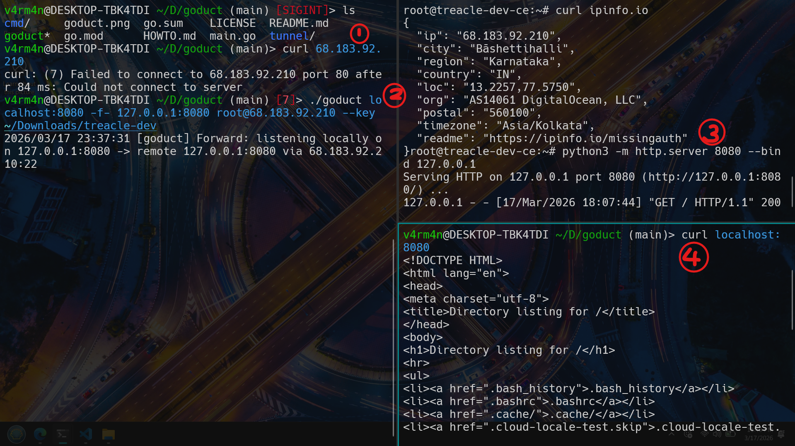

# goduct


> SSH tunnels without the TTY pain.

A dead-simple tunneling tool that speaks native SSH — no agent needed when `sshd` is already running.

## Inspiration

I built `goduct` while diving into [**network pivoting**](https://www.geeksforgeeks.org/computer-networks/pivoting-moving-inside-a-network/) and lateral movement in cybersecurity. During penetration testing, you often need to route your traffic through a compromised jumphost to access isolated internal subnets. While native SSH port forwarding is the go-to technique for this, the syntax is notoriously tedious to remember under pressure. `goduct` is the result of wanting a frictionless, visual way to pivot through networks without fighting the terminal.

## Why?

- `ssh -N -f -L 8080:localhost:80 user@host` is annoying to type, dies silently, and hijacks your terminal.  
- `goduct` fixes that by using an intuitive connector syntax (`-f-` and `-r-`). Single binary, clean CLI, no TTY.

## Install

```bash
git clone https://github.com/v4rm4n/goduct
cd goduct
go build .
```

## Usage

**Syntax:** `goduct [source] [-f- or -r-] [destination] [user@host]`

**Note:** You can use IP addresses _(10.0.1.5:80)_, hostnames _(localhost:8080)_ for the endpoints.

**⚠️Interface Names:** You can use interface names for the local endpoint only! (Interfaces are invalid bind addresses on the remote machine.)

```
./goduct eth0:8080 -f- localhost:8080 root@124.212.241.172 # ✅
./goduct eth0:8080 -r- localhost:8080 root@124.212.241.172 # ❌
```

**Forward (-f-)** — bring a remote service to your machine (ssh -L).
Listen on your local machine, and route traffic through the SSH server to the destination.
```
# Listen locally on 8080, forward to the jumphost's own port 80
goduct localhost:8080 -f- localhost:80 root@jumphost

# Listen locally on all interfaces, reach a private DB only the jumphost can see
goduct 0.0.0.0:5432 -f- db.internal:5432 root@jumphost

# Bind to a specific network interface
goduct eth0:8080 -f- 10.0.0.5:80 root@jumphost
```

**Reverse (-r-**) — expose a local service on the remote server (ssh -R)
Ask the remote SSH server to listen on a port, and route traffic back to a destination from your machine.

```
# Expose your local dev server on the VPS 
goduct 0.0.0.0:9090 -r- localhost:3000 root@vps

# Expose a LAN machine through the VPS
goduct 8080 -r- 192.168.1.50:3000 root@vps
```

## Key insight:
**-f- (Forward)** → destination is resolved by the SSH server

**-r- (Reverse)** → destination is resolved by your machine

## Authentication

goduct tries auth methods in this order — no flags needed in the common case:

| Priority | Method | How |
|---|---|---|
| 1 | Explicit key | `--key ~/.ssh/my_key` |
| 2 | SSH agent | automatic if `$SSH_AUTH_SOCK` is set |
| 3 | Default keys | tries `~/.ssh/id_ed25519`, `id_rsa`, `id_ecdsa` |
| 4 | Password | Secure interactive prompt (hidden input) |

```bash
# Uses agent or default keys automatically (prompts for password if they fail)
goduct localhost:8080 -f- localhost:80 root@host

# Explicit key
goduct localhost:8080 -f- localhost:80 root@host --key ~/Downloads/my-key
```

# Showcase: The Forward Pivot (-f-)



**The Scenario:** You have SSH access to a remote machine, but the internal service you want to reach (like a database, admin panel, or in this case, a dev server) is strictly bound to 127.0.0.1. A restrictive firewall blocks all outside access. We need to pivot.

**(Match the numbers in the screenshot to the steps below)**

**①** **The Barrier (Top Left)**
From our local machine, we try to curl the remote server directly. The connection is instantly refused. The external firewall is doing its job.

**③** **The Target (Top Right):**
On the remote DigitalOcean VPS (68.183.92.210), we spin up a Python HTTP server on port 8080. Notice the --bind 127.0.0.1 flag—this service is isolated and will ignore any traffic that doesn't originate from inside the VPS itself.

**②** **The Pivot (Middle Left):**
We use goduct to punch a hole through the SSH port.

```bash
./goduct localhost:8080 -f- 127.0.0.1:8080 root@68.183.92.210 --key ~/Downloads/treacle-dev
```

**Translation:** _"Listen on my local port 8080, take my traffic, send it securely through the SSH connection, and drop it out on the remote machine's 127.0.0.1:8080."_

**④** **The Payoff (Bottom Right):**
We run curl localhost:8080 on our local machine. The traffic successfully tunnels through the pivot and hits the restricted Python server. We instantly get the HTML directory listing of the remote root folder, and the Python server logs our GET request!

# Roadmap
[x] CLI skeleton (cobra)

[x] Spec parsing and interface resolution (eth0:80, etc.)

[x] Intuitive connector syntax (-f- and -r-)

[x] SSH key auth (explicit key, agent, default paths, secure password prompt)

[x] SSH forward (ssh -L)

[x] SSH reverse (ssh -R)

[ ] Auto-reconnect on drop

[ ] HTTP tunnel fallback (chisel-style, for when port 22 is blocked)
